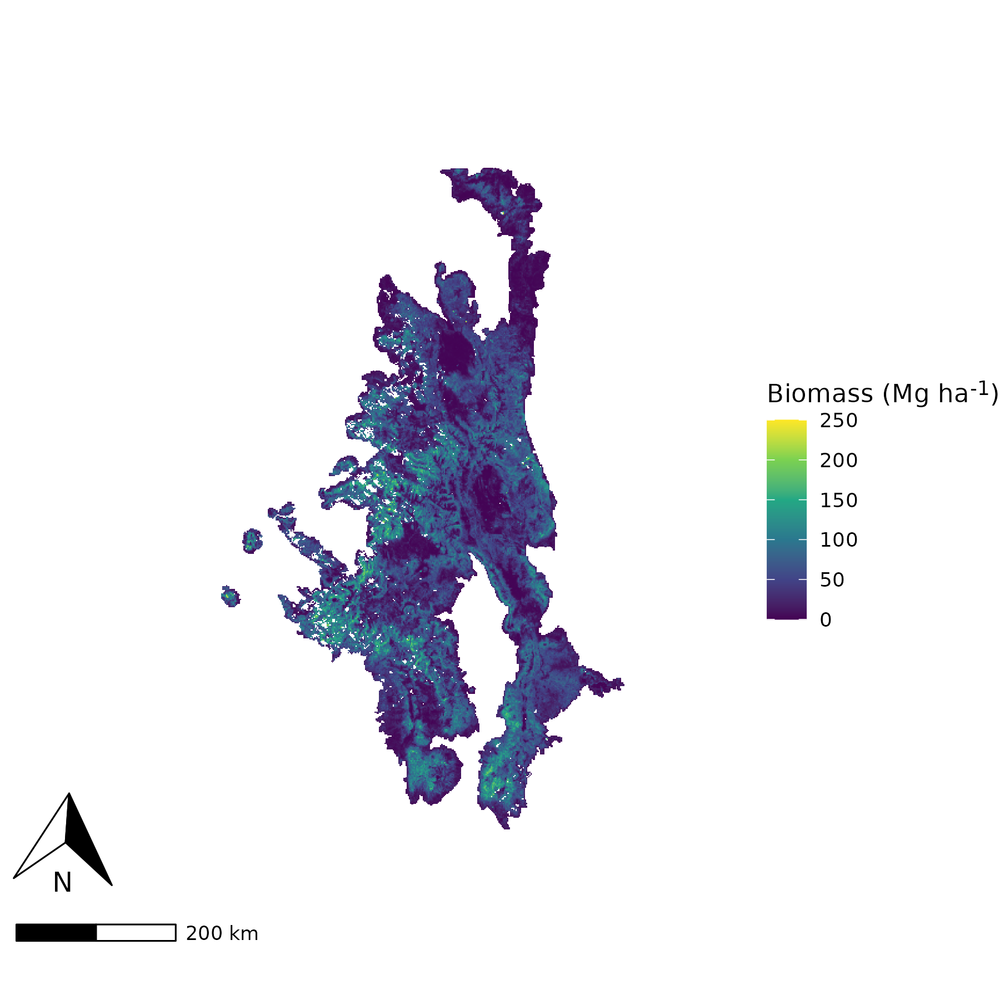

# Project presentation overview

All project presentation materials should be made available on this page.

Your team may present directly from this page if you would like to; alternatively, if you would prefer to use slides to present, please make sure to export your team's slides as a PDF, add them to your GitHub, and add the link to that PDF here below.

# Presentation

To set the stage, enjoy these beautiful pictures of the high alpine Southern Rockies taken on the daring mountain bike adventures of Smaulder Squad member Ashley Woolman.

  
  
  
  
  

For the Souther Rockies region between 2019-2023, here is a map of the GEDI biomass estimate:

